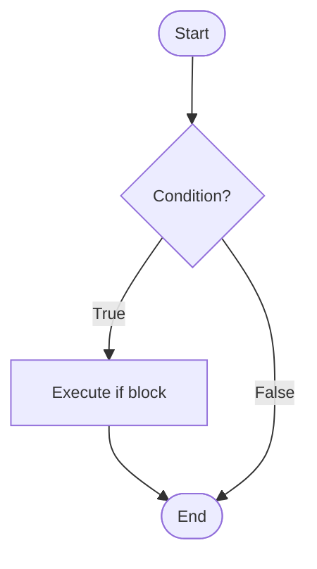
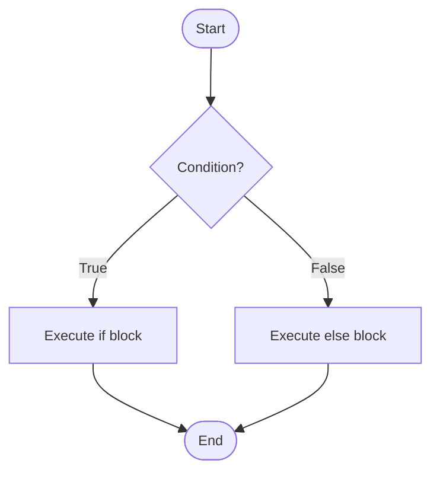
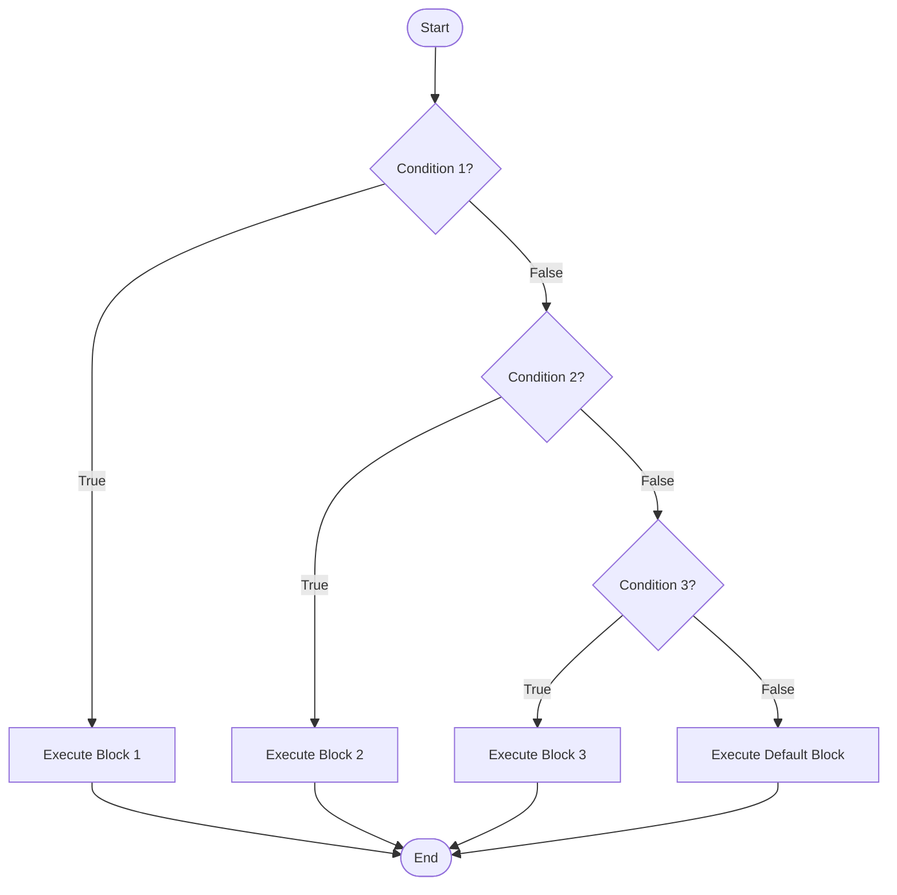
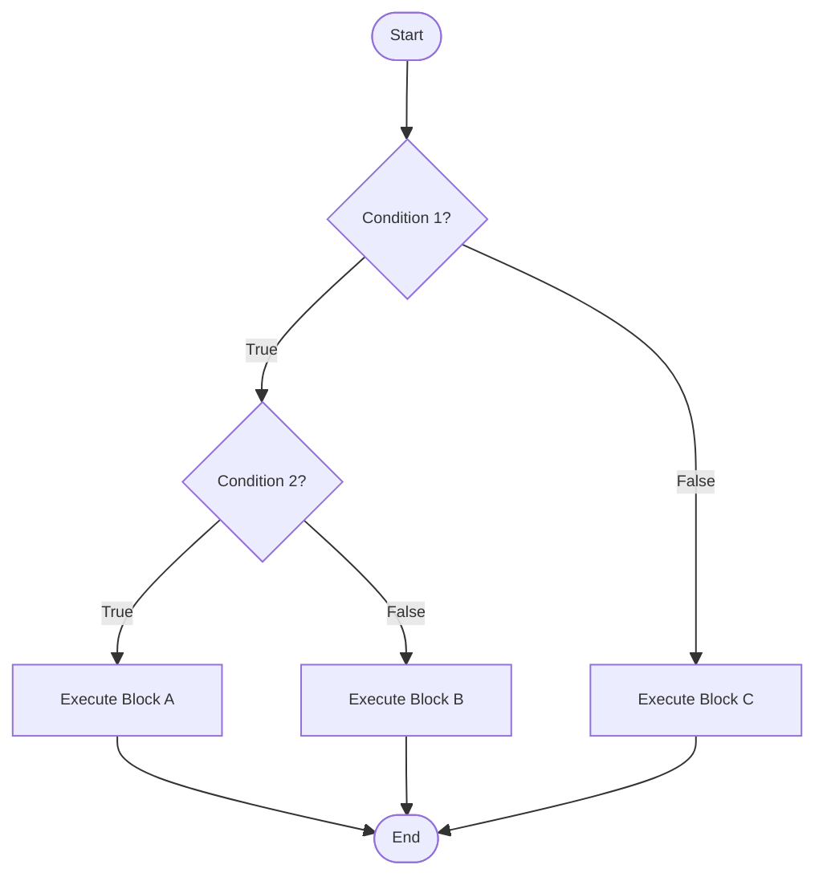

```mermaid
%%{init: {'themeVariables': { 'fontSize': '12px' }} }%%

flowchart TD
    A([Start]) --> B[Evaluate Expression]
    B --> C{Match Case 1?}
    
    C -- Yes --> D[Execute Block 1]
    C -- No --> E{Match Case 2?}
    
    E -- Yes --> F[Execute Block 2]
    E -- No --> G{Match Case 3?}
    
    G -- Yes --> H[Execute Block 3]
    G -- No --> I[Execute Default Block]
    
    D --> J([End])
    F --> J
    H --> J
    I --> J
```

# Decision Making Statements

Decision-making statements evaluate conditions and execute code blocks based on whether those conditions are true or false. These include `if`, `if-else`, `if-else-if` ladder, `nested if`, `switch`, and the `ternary operator`.


## if Statement
It is simplest decision-making statement. The `if` statement executes a block of code only if a specified condition is true.

**Syntax:**
```java
if (condition) {
    // code executes if condition is true
}
```

**Flow Chart:**


**Example:**
```java
int age = 18;

if (age >= 18) {
    System.out.println("You are eligible to vote");
}
```

**Key Points:**

- The condition must be a boolean expression
- Curly braces `{}` are optional for single statements but recommended for clarity
- If condition is false, the code block is skipped entirely. The code block executes only if the condition is true


---


## if-else Statement
The `if-else` statement provides an alternative path of execution when the condition is false.

**Syntax:**
```java
if (condition) {
    // executes if condition is true
} else {
    // executes if condition is false
}
```

**Flow Chart:**


**Example:**
```java
int temperature = 25;

if (temperature > 30) {
    System.out.println("It's hot outside.");
} else {
    System.out.println("The weather is pleasant.");
}
```

**Key Points**

- Exactly one block (either if or else) will execute


---


## if-else-if Ladder
The `if-else-if` ladder tests multiple conditions sequentially. The first condition that evaluates to true will execute its corresponding block, and the rest will be skipped.

**Syntax:**
```java
if (condition1) {
    // executes if condition1 is true
} else if (condition2) {
    // executes if condition1 is false and condition2 is true
} else if (condition3) {
    // executes if condition1 and condition2 are false, condition3 is true
} 
.
.
.
else {
    // executes if all conditions are false
}
```

**Flow Chart:**


**Example:**
```java
int score = 85;
if (score >= 90) {
    System.out.println("Grade: A");
} else if (score >= 80) {
    System.out.println("Grade: B");
} else if (score >= 70) {
    System.out.println("Grade: C");
} else if (score >= 60) {
    System.out.println("Grade: D");
} else {
    System.out.println("Grade: F");
}
```

**Key Points:**

- Conditions are evaluated from top to bottom   
- Only the first true condition's block executes
- The final `else` is optional but provides a default case
- Execution stops after the first match


---


## Nested if Statements
Nested `if` statements are `if` statements inside other `if` statements, allowing for complex decision-making logic.

**Syntax:**
```java
if (condition1) {
    if (condition2) {
        // block A
    } else {
        // block B
    }
} else {
    // block C
}
```

**Flow Chart:**


**Example:**
```java
int age = 25;
boolean hasLicense = true;

if (age >= 18) {
    if (hasLicense) {
        System.out.println("You can drive");
    } else {
        System.out.println("You need a license to drive");
    }
} else {
    System.out.println("You are too young to drive");
}
```


**Key Points:**

- C an nest to any depth, but deep nesting reduces readability
- Each `if` can have its own `else` clause
- Consider refactoring deeply nested conditions using logical operators


---


## switch Statement
The `switch` statement allows multi-way branching based on the value of an expression. It's an alternative to long `if-else-if` ladders.

**Syntax:**
```java
switch (expression) {
    case value1:
        // code for value1
        break;
    case value2:
        // code for value2
        break;
    case value3:
        // code for value3
        break;
    .
    .
    .
    default:
        // code if no case matches
}
```

**Flow Chart:**


**Example:**
```java
int day = 3;
switch (day) {
    case 1:
        System.out.println("Monday");
        break;
    case 2:
        System.out.println("Tuesday");
        break;
    case 3:
        System.out.println("Wednesday");
        break;
    case 4:
        System.out.println("Thursday");
        break;
    case 5:
        System.out.println("Friday");
        break;
    case 6:
        System.out.println("Saturday");
        break;
    case 7:
        System.out.println("Sunday");
        break;
    default:
        System.out.println("Invalid day");
}
```
  


**Key Points:**  

- Switch works with 
    - `byte`, `short`, `int`, `char`
    - `Byte`, `Short`, `Character`, `Integer` (wrapper classes)
    - `String` (Java 7+) and `enum` types
- The `break` statement is crucial to prevent fall-through behavior
- Fall-through occurs when `break` is omitted, causing execution to continue into the next case
- The `default` case is optional but recommended for handling unexpected values
- Multiple cases can share the same code block

**Example of Intentional Fall-through:**
```java
int month = 2;
int days;
switch (month) {
    case 1: case 3: case 5: case 7: case 8: case 10: case 12:
        days = 31;
        break;
    case 4: case 6: case 9: case 11:
        days = 30;
        break;
    case 2:
        days = 28;
        break;
    default:
        days = 0;
}
```
<br>

### Advanced switch Features (Java 12+):  
Switch expressions are an enhanced form of switch introduced in Java 12 (preview) and made standard in Java 14. They can return values and use arrow syntax.

**Syntax:**
```java
result = switch (expression) {
    case value1 -> result1;
    case value2 -> result2;
    case value3 -> result3;
    default -> defaultResult;
};
```

**Example:**
```java
int dayOfWeek = 3;

String dayType = switch (dayOfWeek) {
    case 1, 2, 3, 4, 5 -> "Weekday";
    case 6, 7 -> "Weekend";
    default -> "Invalid day";
};

System.out.println(dayType);
```


### Using yield for Complex Cases:
```java
int score = 85;

String grade = switch (score / 10) {
    case 10, 9 -> "A";
    case 8 -> "B";
    case 7 -> "C";
    case 6 -> "D";
    default -> {
        if (score < 0 || score > 100) {
            yield "Invalid score";
        }
        yield "F";
    }
};

System.out.println("Grade: " + grade);
```

**Key Points:**

- No fall-through; each case is independent
- Can return values directly
- Multiple values can be combined with commas
- Use `yield` for complex expressions in blocks
- More concise and less error-prone than traditional switch


---


## Ternary Operator
A concise way to write simple `if-else` statements in a single line.

**Syntax:**
```java
variable = (condition) ? expressionIfTrue : expressionIfFalse;
```

**Example:**
```java
int a = 10, b = 20;
int max = (a > b) ? a : b;
System.out.println("Maximum: " + max);

// Can be nested (not recommended for readability)
int x = 5;
String result = (x > 0) ? "Positive" : (x < 0) ? "Negative" : "Zero";
```


---