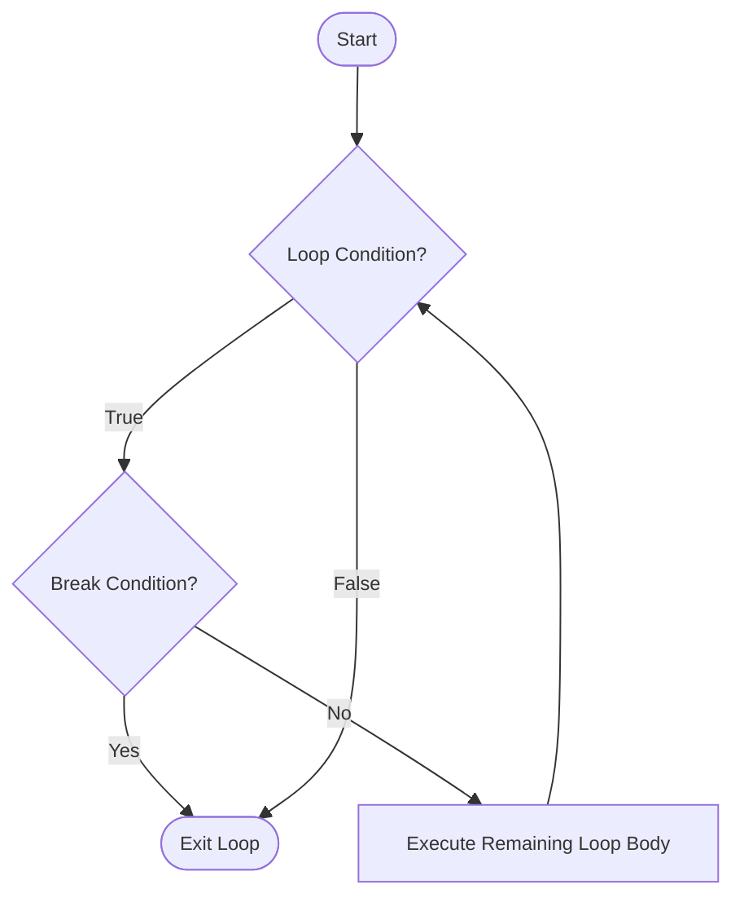
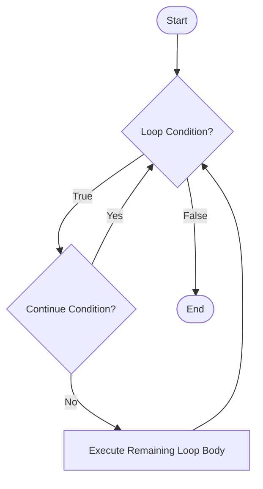
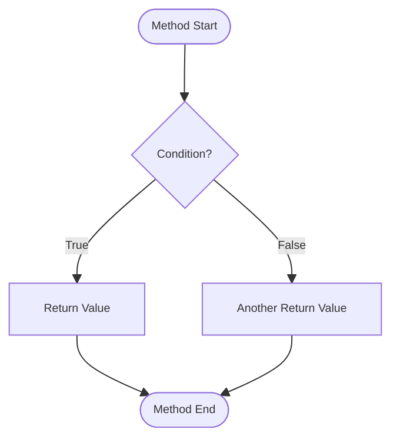

# Jump Statements

Jump statements transfer control to another part of the program. These include `break`, `continue`, and `return`.

## break Statement  
The `break` statement terminates the current loop or switch statement and transfers control to the statement immediately following the loop/switch.


**Flow Chart:**


**In Loops:**
```java
// Find first even number
for (int i = 1; i <= 10; i++) {
    if (i % 2 == 0) {
        System.out.println("First even number: " + i);
        break; // Exit loop
    }
}
```

**In switch:**
```java
int day = 3;

switch (day) {
    case 1:
        System.out.println("Monday");
        break; // Exit switch
    case 2:
        System.out.println("Tuesday");
        break;
    case 3:
        System.out.println("Wednesday");
        break; // Exit switch
    default:
        System.out.println("Other day");
}
```

**In Nested Loops:**
```java
// Break only exits the innermost loop
for (int i = 1; i <= 3; i++) {
    for (int j = 1; j <= 3; j++) {
        if (j == 2) {
            break; // Only exits inner loop
        }
        System.out.println("i: " + i + ", j: " + j);
    }
}
```

- If `break` condition becomes true → loop terminates immediately.
- Control moves outside the loop.


---


## continue Statement
The `continue` statement skips the current iteration of a loop and proceeds to the next iteration.

**Flow Chart:**


**Example:**
```java
// Print odd numbers from 1 to 10
for (int i = 1; i <= 10; i++) {
    if (i % 2 == 0) {
        continue; // Skip even numbers
    }
    System.out.println(i);
}
```

**In while Loop:**
```java
int i = 0;

while (i < 10) {
    i++;
    if (i % 2 == 0) {
        continue; // Skip even numbers
    }
    System.out.println(i);
}
```


**Key Points:**

- If `continue` condition is true → skip remaining statements
- Control jumps to next iteration
- **In `for` loop**: jumps to the update statement
- **In `while`/`do-while`**: jumps to the condition check
- Loop does NOT terminate
- Only affects the innermost loop in nested loops


---


## return Statement
The `return` statement exits from the current method and optionally returns a value to the caller.

**Syntax:**
```java
return; // For void methods
return value; // For methods returning a value
```

**Flow Chart:**


**Example:**
```java
public int findMax(int a, int b) {
    if (a > b) {
        return a; // Exit method and return a
    } else {
        return b; // Exit method and return b
    }
}

public void printMessage(String message) {
    if (message == null) {
        return; // Exit method early
    }
    System.out.println(message);
}
```

**Key Points:**

- `return` immediately exits the method
- Control goes back to the caller
- No further code executes in that method
- Can be used for early termination
- Must return appropriate type for non-void methods

---


## Labeled break and continue
Labels allow you to break out of or continue with outer loops in nested loop structures.

**Syntax:**
```java
labelName:
for (...) {
    for (...) {
        break labelName; // Breaks out of labeled loop
        continue labelName; // Continues with labeled loop
    }
}
```

**Labeled break Example:**
```java
outerLoop:
for (int i = 1; i <= 3; i++) {
    for (int j = 1; j <= 3; j++) {
        if (i == 2 && j == 2) {
            System.out.println("Breaking out of outer loop");
            break outerLoop; // Exits both loops
        }
        System.out.println("i: " + i + ", j: " + j);
    }
}
System.out.println("Outside loops");
```

**Output:**
```java
i: 1, j: 1
i: 1, j: 2
i: 1, j: 3
i: 2, j: 1
Breaking out of outer loop
Outside loops
```


**Labeled continue Example:**
```java
outerLoop:
for (int i = 1; i <= 3; i++) {
    for (int j = 1; j <= 3; j++) {
        if (j == 2) {
            continue outerLoop; // Skip to next iteration of outer loop
        }
        System.out.println("i: " + i + ", j: " + j);
    }
}
```


**Output:**
```java
i: 1, j: 1
i: 2, j: 1
i: 3, j: 1
```

**Key Points:**

- Use sparingly; can reduce code readability
- Useful for complex nested loop scenarios
- Label must be immediately before the loop
- Provides better control than using flags


---
