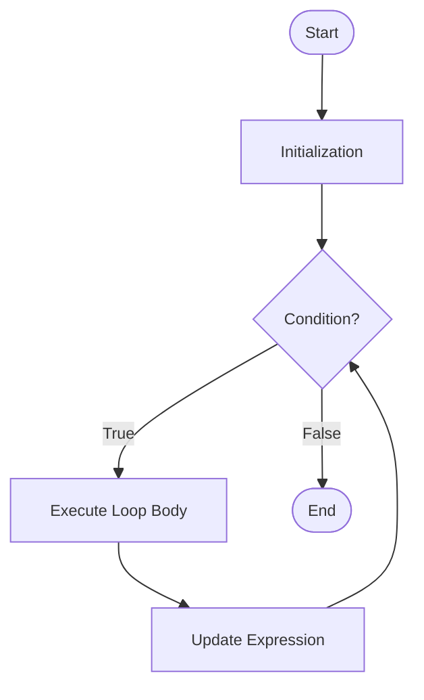
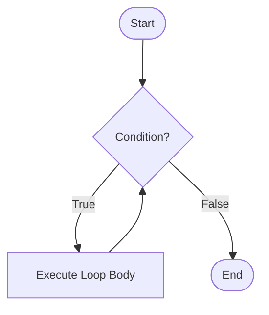
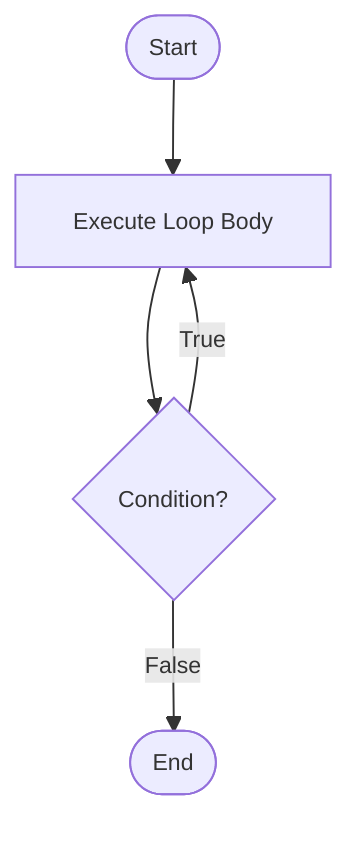

# Looping Statements

Loops allow you to execute a block of code repeatedly based on a condition. Java provides `for` loop, `while` loop, `do-while` loop, and enhanced `for-each` loop.

##  for Loop
The `for` loop is used when you know in advance how many times you want to execute a statement or block.

**Syntax:**
```java
for (initialization; condition; update) {
    // code to be executed
}
```

**Flow Chart:**


**Example:**
```java
// Print numbers 1 to 10
for (int i = 1; i <= 10; i++) {
    System.out.println(i);
}
```


**Components:**

1. **Initialization**: Executed once at the start (e.g., int i = 1)
2. **Condition**: Checked before each iteration (e.g., i <= 10)
3. **Update**: Executed after each iteration (e.g., i++)


**Execution Flow:**

1. Initialization executes once at the beginning
2. Condition is evaluated before each iteration
3. If condition is true, loop body executes
4. Update statement executes after each iteration
5. Process repeats from step 2
   


**Multiple Variables:**
```java
for (int i = 0, j = 10; i < j; i++, j--) {
    System.out.println("i: " + i + ", j: " + j);
}
```


**Infinite Loop:**
```java
for (;;) {
    // This loop runs forever
    // Use break to exit
}
```


---


## while Loop
The `while` loop executes a block of code as long as a specified condition is true. It's a pre-test loop (condition checked before execution).

**Syntax:**
```java
while (condition) {
    // code to be executed
}
```

**Flow Chart:**



**Example:**
```java
int count = 1;
while (count <= 5) {
    System.out.println("Count: " + count);
    count++;
}

// Reading input until a sentinel value
Scanner scanner = new Scanner(System.in);
int number = scanner.nextInt();
while (number != -1) {
    System.out.println("You entered: " + number);
    number = scanner.nextInt();
}
```

**Key Points:**

- Condition is evaluated before each iteration
- If the condition is initially false, the loop body never executes
- Must ensure the condition eventually becomes false to avoid infinite loops
- Useful when the number of iterations is unknown


---


## do-while Loop
The `do-while` loop is similar to `while`, but it's a post-test loop (condition checked after execution). It guarantees at least one execution.

**Syntax:**
```java
do {
    // code to be executed
} while (condition);
```

**Flow Chart**


**Example:**
```java
int count = 1;

do {
    System.out.println("Count: " + count);
    count++;
} while (count <= 5);
```

**Key Points:**

- `do-while` executes at least once regardless of condition
- Condition checked after the loop body
- `while` may not execute at all if condition is initially false
- Useful for input validation and menu-driven programs


---


## Enhanced for Loop (`for-each`)
The enhanced `for` loop (introduced in Java 5) provides a simpler way to iterate over arrays and collections.

**Syntax:**
```java
for (dataType variable : arrayOrCollection) {
    // code using variable
}
```

**Array Example::**
```java
int[] numbers = {1, 2, 3, 4, 5};

for (int num : numbers) {
    System.out.println(num);
}
```


**Collection Example:**
```java
List<String> fruits = Arrays.asList("Apple", "Banana", "Cherry");

for (String fruit : fruits) {
    System.out.println(fruit);
}
```


**Key Points:**

- Primarily used for read-only traversal
- Cannot modify the structure of an array or collection (no add/remove operations)
- Cleaner and less error-prone than a traditional `for` loop
- No direct access to the index
- Works with:
    - Arrays
    - Any class implementing `Iterable`

**Limitations:**

- Cannot modify **primitive array elements** (the loop variable is a copy; reassignment does not affect the original array)
- Cannot directly track the index during iteration
- Can only iterate forward in single-step increments
- Cannot iterate over multiple arrays/collections simultaneously
- Cannot safely remove elements from a collection during iteration (may cause `ConcurrentModificationException`)


---


## Nested Loops
Nested loops are loops inside other loops. The inner loop completes all its iterations for each iteration of the outer loop.

**Example:**
```java
for (int i = 1; i <= 10; i++) {
    for (int j = 1; j <= 10; j++) {
        System.out.printf("%4d", i * j);
    }
    System.out.println();
}
```

**Key Points:**

- Time complexity multiplies (O(n²) for two nested loops)
- Useful for multi-dimensional data structures
- Can nest any type of loop (`for`, `while`, `do-while`)


---