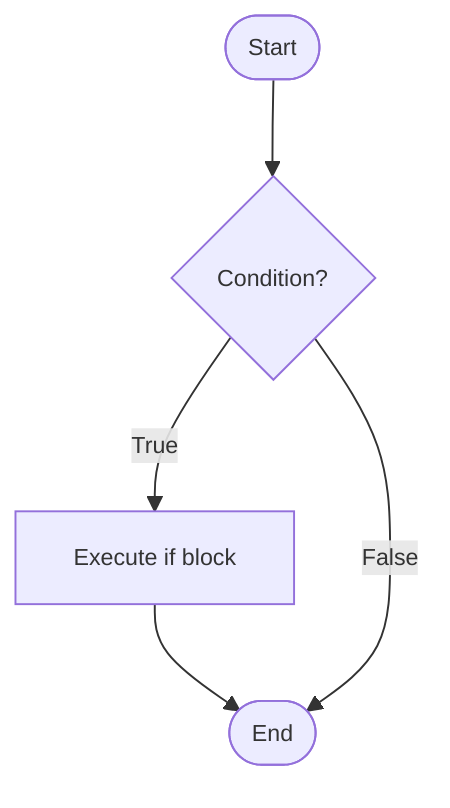
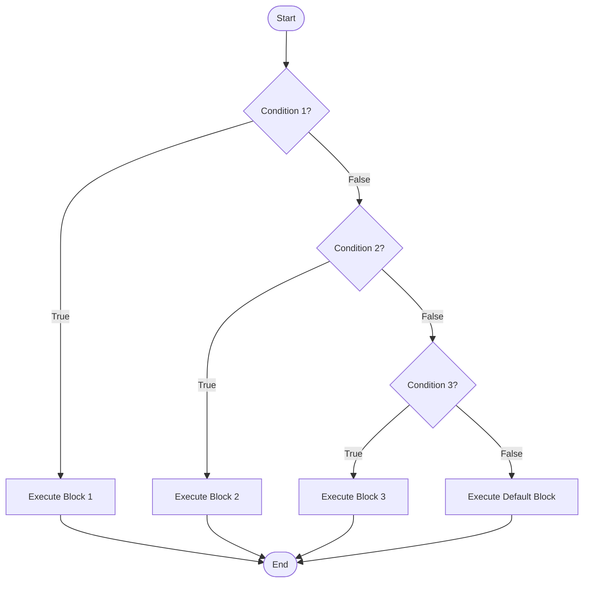
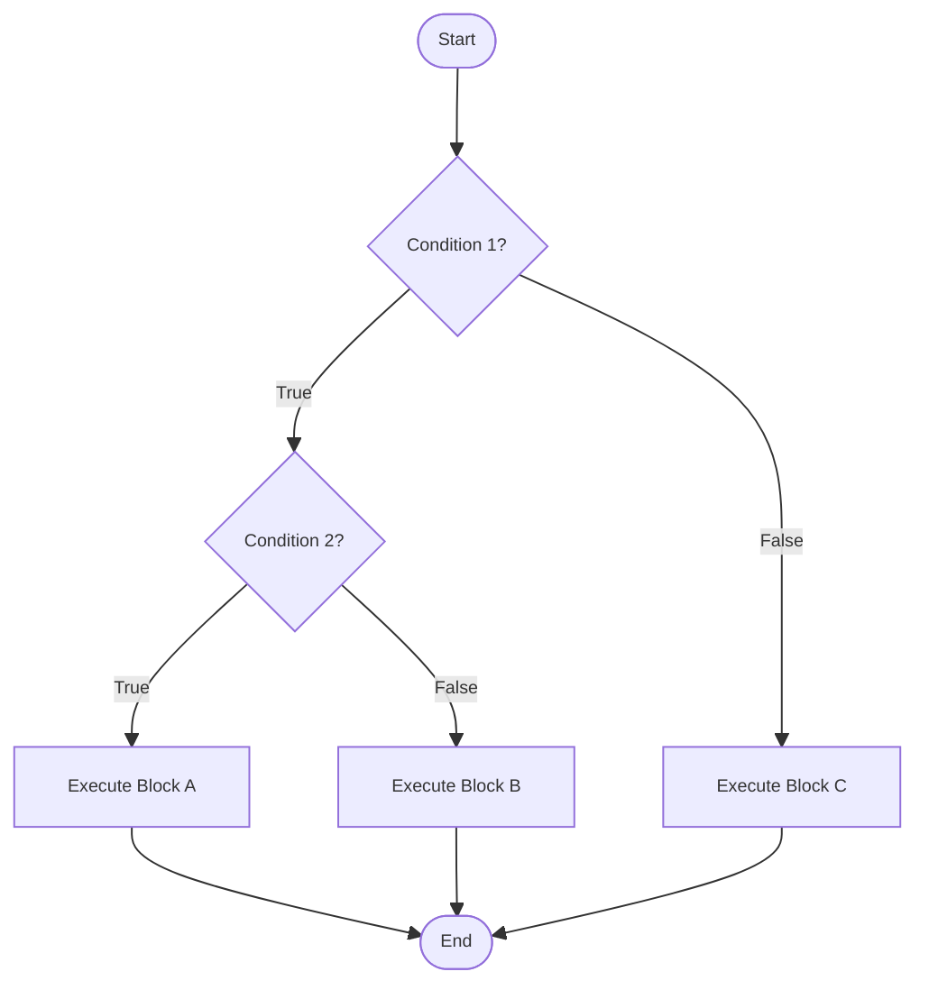
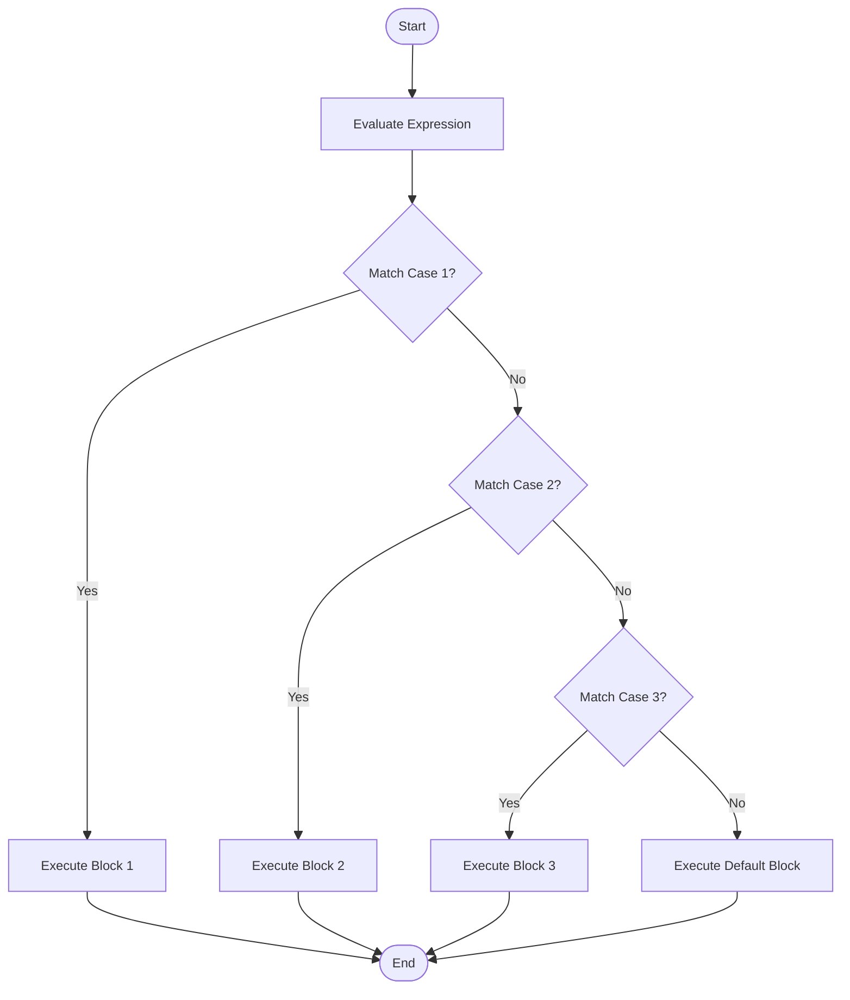
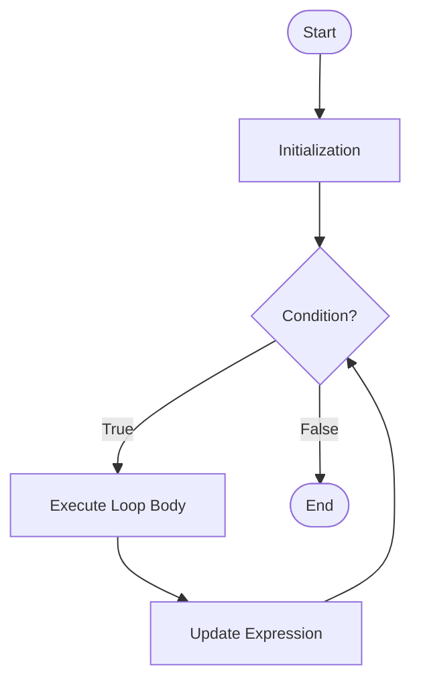
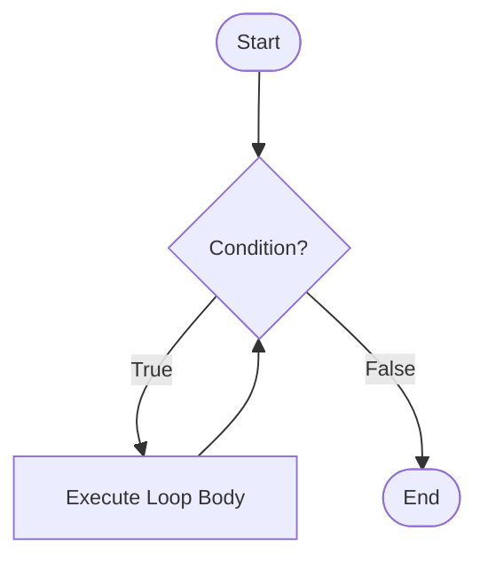
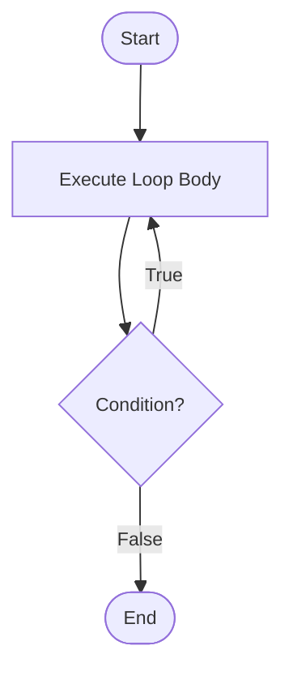
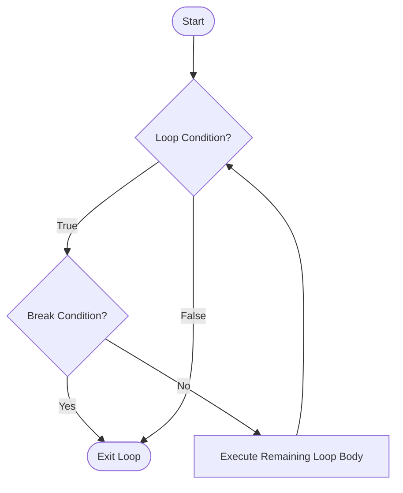
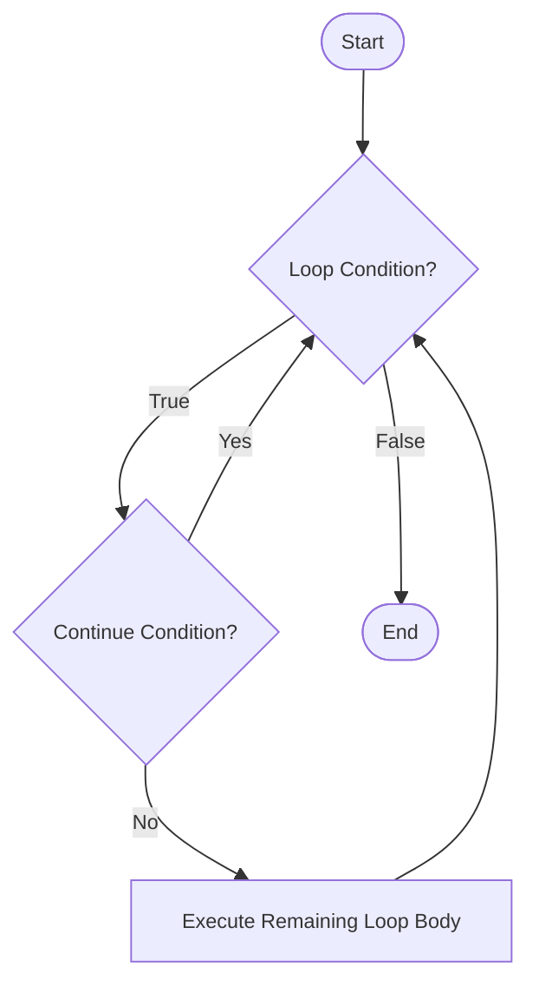

# Control Flow Statements

## Introduction
Control flow statements determine the **order in which code executes** in a program. By default, Java executes statements sequentially from top to bottom Control flow statements allow you to **alter this sequential execution** based on conditions, repeat code blocks, or jump to different parts of your program.

Java provides **three main categories** of control flow statements:  

1. **Decision-Making Statements**
2. **Looping Statements**
3. **Jump Statements**

---


## **Decision-Making Statements**
Decision-making statements evaluate conditions and execute code blocks based on whether those conditions are true or false. These include `if`, `if-else`, `if-else-if` ladder, `nested if`, `switch`, and the `ternary operator`.


### if Statement
It is simplest decision-making statement. The `if` statement executes a block of code only if a specified condition is true.

**Syntax:**
```java
if (condition) {
    // code executes if condition is true
}
```

**Flow Chart:**


**Example:**
```java
int age = 18;

if (age >= 18) {
    System.out.println("You are eligible to vote");
}
```

**Key Points:**

- The condition must be a boolean expression
- Curly braces `{}` are optional for single statements but recommended for clarity
- If condition is false, the code block is skipped entirely. The code block executes only if the condition is true


---


### if-else Statement
The `if-else` statement provides an alternative path of execution when the condition is false.

**Syntax:**
```java
if (condition) {
    // executes if condition is true
} else {
    // executes if condition is false
}
```

**Flow Chart:**


**Example:**
```java
int temperature = 25;

if (temperature > 30) {
    System.out.println("It's hot outside.");
} else {
    System.out.println("The weather is pleasant.");
}
```

**Key Points**

- Exactly one block (either if or else) will execute


---


### if-else-if Ladder
The `if-else-if` ladder tests multiple conditions sequentially. The first condition that evaluates to true will execute its corresponding block, and the rest will be skipped.

**Syntax:**
```java
if (condition1) {
    // executes if condition1 is true
} else if (condition2) {
    // executes if condition1 is false and condition2 is true
} else if (condition3) {
    // executes if condition1 and condition2 are false, condition3 is true
} 
.
.
.
else {
    // executes if all conditions are false
}
```

**Flow Chart:**


**Example:**
```java
int score = 85;
if (score >= 90) {
    System.out.println("Grade: A");
} else if (score >= 80) {
    System.out.println("Grade: B");
} else if (score >= 70) {
    System.out.println("Grade: C");
} else if (score >= 60) {
    System.out.println("Grade: D");
} else {
    System.out.println("Grade: F");
}
```

**Key Points:**

- Conditions are evaluated from top to bottom   
- Only the first true condition's block executes
- The final `else` is optional but provides a default case
- Execution stops after the first match


---


### Nested if Statements
Nested `if` statements are `if` statements inside other `if` statements, allowing for complex decision-making logic.

**Syntax:**
```java
if (condition1) {
    if (condition2) {
        // block A
    } else {
        // block B
    }
} else {
    // block C
}
```

**Flow Chart:**


**Example:**
```java
int age = 25;
boolean hasLicense = true;

if (age >= 18) {
    if (hasLicense) {
        System.out.println("You can drive");
    } else {
        System.out.println("You need a license to drive");
    }
} else {
    System.out.println("You are too young to drive");
}
```


**Key Points:**

- C an nest to any depth, but deep nesting reduces readability
- Each `if` can have its own `else` clause
- Consider refactoring deeply nested conditions using logical operators


---


### switch Statement
The `switch` statement allows multi-way branching based on the value of an expression. It's an alternative to long `if-else-if` ladders.

**Syntax:**
```java
switch (expression) {
    case value1:
        // code for value1
        break;
    case value2:
        // code for value2
        break;
    case value3:
        // code for value3
        break;
    .
    .
    .
    default:
        // code if no case matches
}
```

**Flow Chart:**


**Example:**
```java
int day = 3;
switch (day) {
    case 1:
        System.out.println("Monday");
        break;
    case 2:
        System.out.println("Tuesday");
        break;
    case 3:
        System.out.println("Wednesday");
        break;
    case 4:
        System.out.println("Thursday");
        break;
    case 5:
        System.out.println("Friday");
        break;
    case 6:
        System.out.println("Saturday");
        break;
    case 7:
        System.out.println("Sunday");
        break;
    default:
        System.out.println("Invalid day");
}
```
  


**Key Points:**  

- Switch works with 
    - `byte`, `short`, `int`, `char`
    - `Byte`, `Short`, `Character`, `Integer` (wrapper classes)
    - `String` (Java 7+) and `enum` types
- The `break` statement is crucial to prevent fall-through behavior
- Fall-through occurs when `break` is omitted, causing execution to continue into the next case
- The `default` case is optional but recommended for handling unexpected values
- Multiple cases can share the same code block

**Example of Intentional Fall-through:**
```java
int month = 2;
int days;
switch (month) {
    case 1: case 3: case 5: case 7: case 8: case 10: case 12:
        days = 31;
        break;
    case 4: case 6: case 9: case 11:
        days = 30;
        break;
    case 2:
        days = 28;
        break;
    default:
        days = 0;
}
```
<br>

#### Advanced switch Features (Java 12+):  
Switch expressions are an enhanced form of switch introduced in Java 12 (preview) and made standard in Java 14. They can return values and use arrow syntax.

**Syntax:**
```java
result = switch (expression) {
    case value1 -> result1;
    case value2 -> result2;
    case value3 -> result3;
    default -> defaultResult;
};
```

**Example:**
```java
int dayOfWeek = 3;

String dayType = switch (dayOfWeek) {
    case 1, 2, 3, 4, 5 -> "Weekday";
    case 6, 7 -> "Weekend";
    default -> "Invalid day";
};

System.out.println(dayType);
```


#### Using yield for Complex Cases:
```java
int score = 85;

String grade = switch (score / 10) {
    case 10, 9 -> "A";
    case 8 -> "B";
    case 7 -> "C";
    case 6 -> "D";
    default -> {
        if (score < 0 || score > 100) {
            yield "Invalid score";
        }
        yield "F";
    }
};

System.out.println("Grade: " + grade);
```

**Key Points:**

- No fall-through; each case is independent
- Can return values directly
- Multiple values can be combined with commas
- Use `yield` for complex expressions in blocks
- More concise and less error-prone than traditional switch


---


### Ternary Operator
A concise way to write simple `if-else` statements in a single line.

**Syntax:**
```java
variable = (condition) ? expressionIfTrue : expressionIfFalse;
```

**Example:**
```java
int a = 10, b = 20;
int max = (a > b) ? a : b;
System.out.println("Maximum: " + max);

// Can be nested (not recommended for readability)
int x = 5;
String result = (x > 0) ? "Positive" : (x < 0) ? "Negative" : "Zero";
```


---


## **Looping Statements**
Loops allow you to execute a block of code repeatedly based on a condition. Java provides `for` loop, `while` loop, `do-while` loop, and enhanced `for-each` loop.

###  for Loop
The `for` loop is used when you know in advance how many times you want to execute a statement or block.

**Syntax:**
```java
for (initialization; condition; update) {
    // code to be executed
}
```

**Flow Chart:**


**Example:**
```java
// Print numbers 1 to 10
for (int i = 1; i <= 10; i++) {
    System.out.println(i);
}
```


**Components:**

1. **Initialization**: Executed once at the start (e.g., int i = 1)
2. **Condition**: Checked before each iteration (e.g., i <= 10)
3. **Update**: Executed after each iteration (e.g., i++)


**Execution Flow:**

1. Initialization executes once at the beginning
2. Condition is evaluated before each iteration
3. If condition is true, loop body executes
4. Update statement executes after each iteration
5. Process repeats from step 2
   


**Multiple Variables:**
```java
for (int i = 0, j = 10; i < j; i++, j--) {
    System.out.println("i: " + i + ", j: " + j);
}
```


**Infinite Loop:**
```java
for (;;) {
    // This loop runs forever
    // Use break to exit
}
```


---


### while Loop
The `while` loop executes a block of code as long as a specified condition is true. It's a pre-test loop (condition checked before execution).

**Syntax:**
```java
while (condition) {
    // code to be executed
}
```

**Flow Chart:**



**Example:**
```java
int count = 1;
while (count <= 5) {
    System.out.println("Count: " + count);
    count++;
}

// Reading input until a sentinel value
Scanner scanner = new Scanner(System.in);
int number = scanner.nextInt();
while (number != -1) {
    System.out.println("You entered: " + number);
    number = scanner.nextInt();
}
```

**Key Points:**

- Condition is evaluated before each iteration
- If the condition is initially false, the loop body never executes
- Must ensure the condition eventually becomes false to avoid infinite loops
- Useful when the number of iterations is unknown


---


### do-while Loop
The `do-while` loop is similar to `while`, but it's a post-test loop (condition checked after execution). It guarantees at least one execution.

**Syntax:**
```java
do {
    // code to be executed
} while (condition);
```

**Flow Chart**


**Example:**
```java
int count = 1;

do {
    System.out.println("Count: " + count);
    count++;
} while (count <= 5);
```

**Key Points:**

- `do-while` executes at least once regardless of condition
- Condition checked after the loop body
- `while` may not execute at all if condition is initially false
- Useful for input validation and menu-driven programs


---


### Enhanced for Loop (`for-each`)
The enhanced `for` loop (introduced in Java 5) provides a simpler way to iterate over arrays and collections.

**Syntax:**
```java
for (dataType variable : arrayOrCollection) {
    // code using variable
}
```

**Array Example::**
```java
int[] numbers = {1, 2, 3, 4, 5};

for (int num : numbers) {
    System.out.println(num);
}
```


**Collection Example:**
```java
List<String> fruits = Arrays.asList("Apple", "Banana", "Cherry");

for (String fruit : fruits) {
    System.out.println(fruit);
}
```


**Key Points:**

- Primarily used for read-only traversal
- Cannot modify the structure of an array or collection (no add/remove operations)
- Cleaner and less error-prone than a traditional `for` loop
- No direct access to the index
- Works with:
    - Arrays
    - Any class implementing `Iterable`

**Limitations:**

- Cannot modify **primitive array elements** (the loop variable is a copy; reassignment does not affect the original array)
- Cannot directly track the index during iteration
- Can only iterate forward in single-step increments
- Cannot iterate over multiple arrays/collections simultaneously
- Cannot safely remove elements from a collection during iteration (may cause `ConcurrentModificationException`)


---


### Nested Loops
Nested loops are loops inside other loops. The inner loop completes all its iterations for each iteration of the outer loop.

**Example:**
```java
for (int i = 1; i <= 10; i++) {
    for (int j = 1; j <= 10; j++) {
        System.out.printf("%4d", i * j);
    }
    System.out.println();
}
```

**Key Points:**

- Time complexity multiplies (O(n²) for two nested loops)
- Useful for multi-dimensional data structures
- Can nest any type of loop (`for`, `while`, `do-while`)


---


## **Jump Statements**
Jump statements transfer control to another part of the program. These include `break`, `continue`, and `return`.

### break Statement  
The `break` statement terminates the current loop or switch statement and transfers control to the statement immediately following the loop/switch.


**Flow Chart:**


**In Loops:**
```java
// Find first even number
for (int i = 1; i <= 10; i++) {
    if (i % 2 == 0) {
        System.out.println("First even number: " + i);
        break; // Exit loop
    }
}
```

**In switch:**
```java
int day = 3;

switch (day) {
    case 1:
        System.out.println("Monday");
        break; // Exit switch
    case 2:
        System.out.println("Tuesday");
        break;
    case 3:
        System.out.println("Wednesday");
        break; // Exit switch
    default:
        System.out.println("Other day");
}
```

**In Nested Loops:**
```java
// Break only exits the innermost loop
for (int i = 1; i <= 3; i++) {
    for (int j = 1; j <= 3; j++) {
        if (j == 2) {
            break; // Only exits inner loop
        }
        System.out.println("i: " + i + ", j: " + j);
    }
}
```

- If `break` condition becomes true → loop terminates immediately.
- Control moves outside the loop.


---


### continue Statement
The `continue` statement skips the current iteration of a loop and proceeds to the next iteration.

**Flow Chart:**


**Example:**
```java
// Print odd numbers from 1 to 10
for (int i = 1; i <= 10; i++) {
    if (i % 2 == 0) {
        continue; // Skip even numbers
    }
    System.out.println(i);
}
```

**In while Loop:**
```java
int i = 0;

while (i < 10) {
    i++;
    if (i % 2 == 0) {
        continue; // Skip even numbers
    }
    System.out.println(i);
}
```


**Key Points:**

- If `continue` condition is true → skip remaining statements
- Control jumps to next iteration
- **In `for` loop**: jumps to the update statement
- **In `while`/`do-while`**: jumps to the condition check
- Loop does NOT terminate
- Only affects the innermost loop in nested loops


---


### return Statement
The `return` statement exits from the current method and optionally returns a value to the caller.

**Syntax:**
```java
return; // For void methods
return value; // For methods returning a value
```

**Flow Chart:**


**Example:**
```java
public int findMax(int a, int b) {
    if (a > b) {
        return a; // Exit method and return a
    } else {
        return b; // Exit method and return b
    }
}

public void printMessage(String message) {
    if (message == null) {
        return; // Exit method early
    }
    System.out.println(message);
}
```

**Key Points:**

- `return` immediately exits the method
- Control goes back to the caller
- No further code executes in that method
- Can be used for early termination
- Must return appropriate type for non-void methods

---


### Labeled break and continue
Labels allow you to break out of or continue with outer loops in nested loop structures.

**Syntax:**
```java
labelName:
for (...) {
    for (...) {
        break labelName; // Breaks out of labeled loop
        continue labelName; // Continues with labeled loop
    }
}
```

**Labeled break Example:**
```java
outerLoop:
for (int i = 1; i <= 3; i++) {
    for (int j = 1; j <= 3; j++) {
        if (i == 2 && j == 2) {
            System.out.println("Breaking out of outer loop");
            break outerLoop; // Exits both loops
        }
        System.out.println("i: " + i + ", j: " + j);
    }
}
System.out.println("Outside loops");
```

**Output:**
```java
i: 1, j: 1
i: 1, j: 2
i: 1, j: 3
i: 2, j: 1
Breaking out of outer loop
Outside loops
```


**Labeled continue Example:**
```java
outerLoop:
for (int i = 1; i <= 3; i++) {
    for (int j = 1; j <= 3; j++) {
        if (j == 2) {
            continue outerLoop; // Skip to next iteration of outer loop
        }
        System.out.println("i: " + i + ", j: " + j);
    }
}
```


**Output:**
```java
i: 1, j: 1
i: 2, j: 1
i: 3, j: 1
```

**Key Points:**

- Use sparingly; can reduce code readability
- Useful for complex nested loop scenarios
- Label must be immediately before the loop
- Provides better control than using flags


---

## **Common Mistakes**

1. **Forgetting break** in switch statements leads to fall-through behavior:
```java
// Bug: will print multiple days
switch (day) {
    case 1:
        System.out.println("Monday");
    case 2:
        System.out.println("Tuesday");  // executes even when day is 1
}
```
2. **Semicolon After if/while/for**
```java
if (x > 10); // Semicolon here!
{
    System.out.println("x is greater than 10");
}
// This block always executes
```

3. **Using assignment instead of comparison:** 
```java
if (x = 5) { }  // Compilation error in Java (good!)
```

4. **Off-by-one errors** in loops:
```java
// Bug: misses last element
for (int i = 0; i < array.length - 1; i++) { }

// Correct
for (int i = 0; i < array.length; i++) { }

```

5. **Modifying loop variables incorrectly:**
```java
// Bug: infinite loop
for (int i = 0; i < 10; i--) { }

int i = 0;
while (i < 10) {
    System.out.println(i);
    // Forgot to increment i
}
```

6. **Wrong Loop Choice**
```java
String[] names = {"Alice", "Bob", "Charlie"};

for (String name : names) {
    // Can't access index here
}
```

7. **Modifying Collection During Enhanced for Loop**
```java
List<String> list = new ArrayList<>(Arrays.asList("A", "B", "C"));

for (String item : list) {
    if (item.equals("B")) {
        list.remove(item); // ConcurrentModificationException
    }
}
```

8. **Floating-Point Comparison**
```java
double a = 0.1 + 0.2;
if (a == 0.3) { // May not work due to precision issues
    System.out.println("Equal");
}
```

9. **Comparing strings** with == instead of equals():
```java
// Wrong
if (str == "hello") { }

// Correct
if (str.equals("hello")) { }
```


## **Best Practices**

1. **Always use braces** for if/else and loops, even for single statements, to prevent bugs during maintenance.
2. **Avoid deep nesting** of `if` statements. Consider refactoring into separate methods or using early returns.
3. **Use meaningful conditions** and avoid magic numbers:
```java
   // Bad
if (status == 1) { }

// Good
final int ACTIVE = 1;
if (status == ACTIVE) { }
```
4. **Choose the right** loop based on your needs. Use `for` when iterations are known, `while` when they depend on conditions, and `for-each` for simple traversal.
5. **Be cautious with infinite loops** and always ensure a proper exit condition.
   


## **Performance Considerations**
The choice between different control structures can impact performance. `for-each` loops are generally as fast as traditional `for` loops. `Switch` statements with many cases can be optimized by the JVM into jump tables, making them faster than equivalent `if-else` chains for certain scenarios.