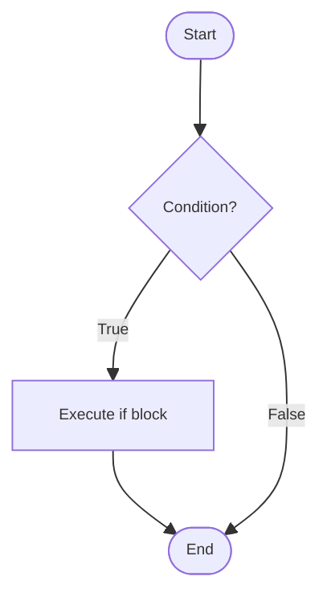
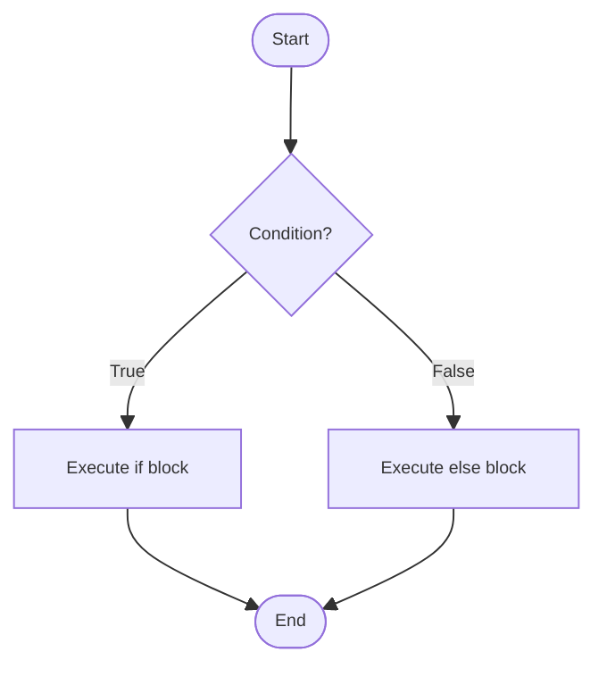
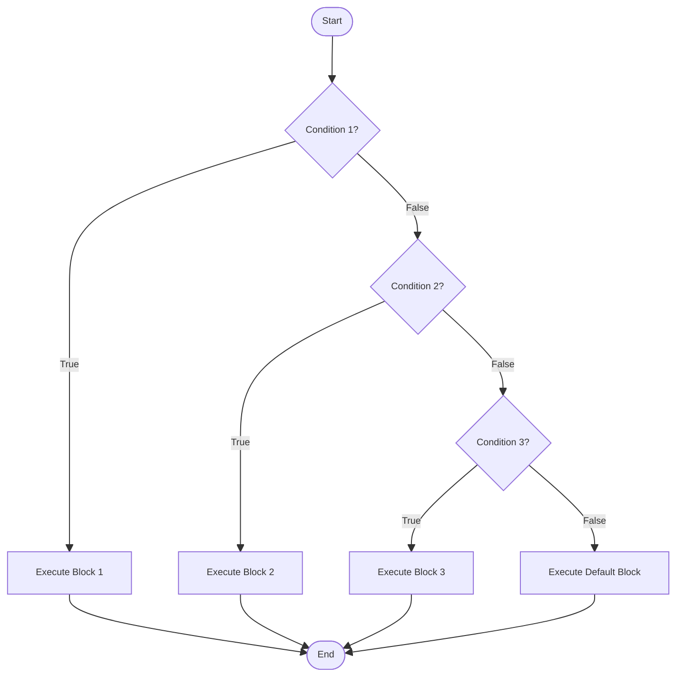
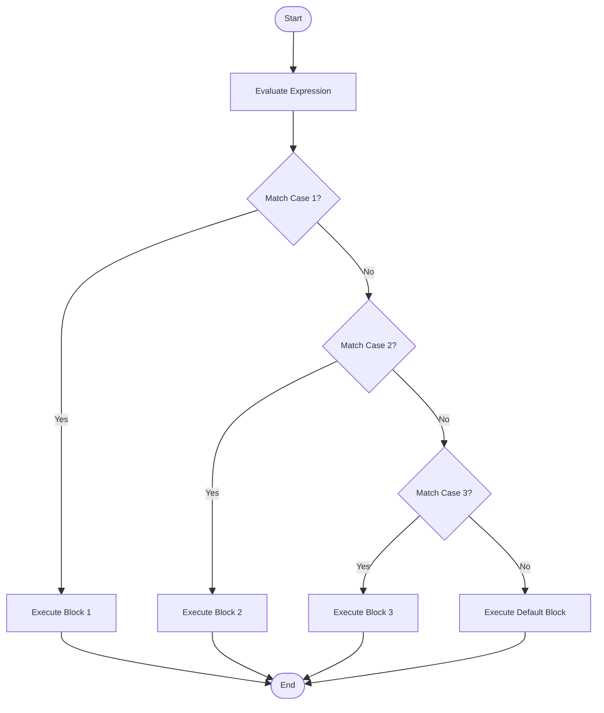
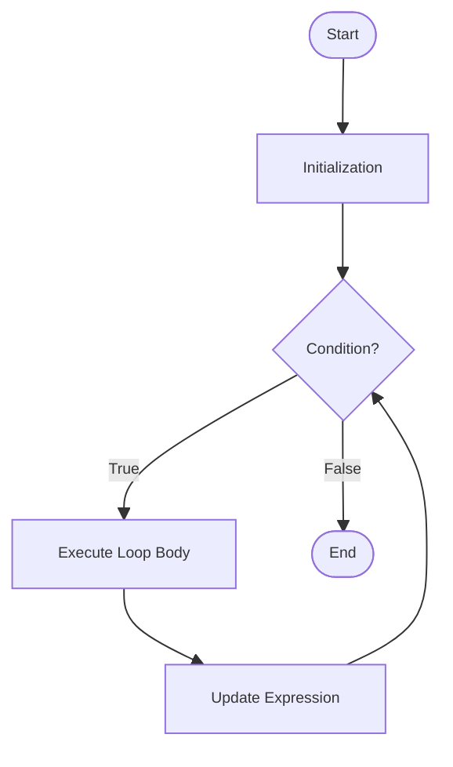
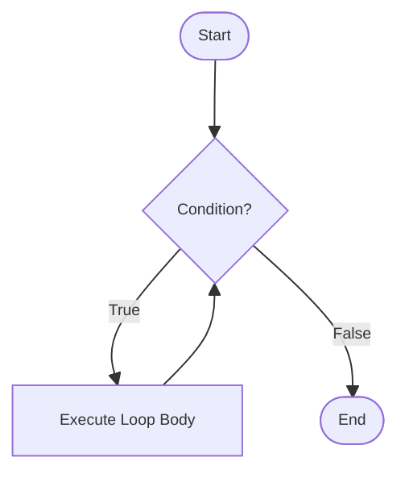
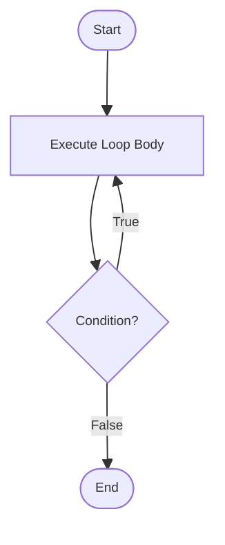
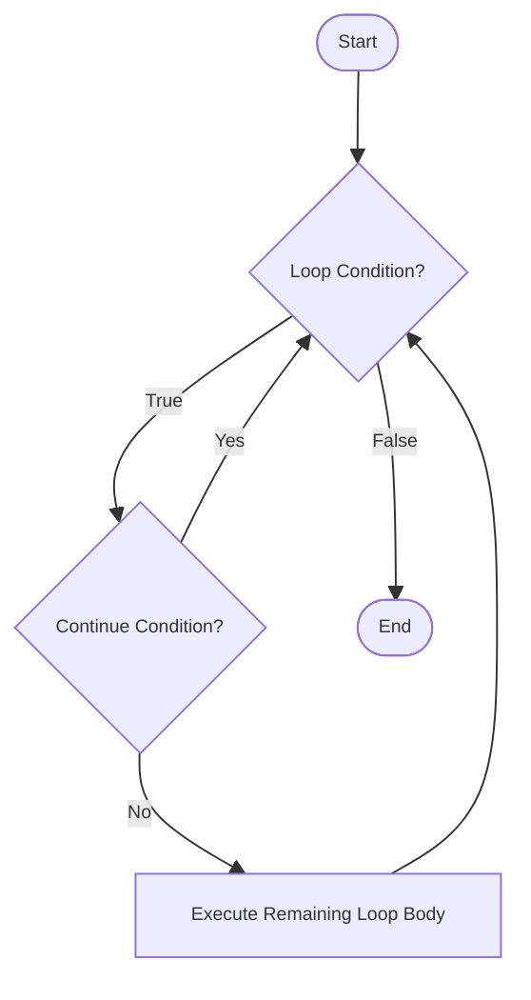
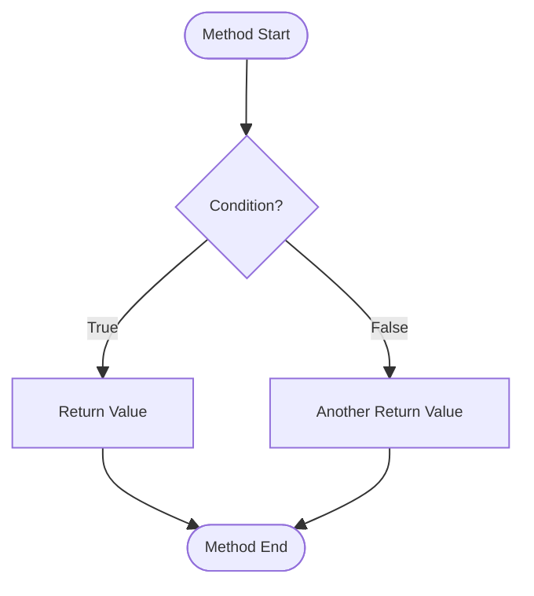

# Control Flow Statements

## Introduction
Control flow statements determine the **order in which code executes** in a program. By default, Java executes statements sequentially from top to bottom Control flow statements allow you to **alter this sequential execution** based on conditions, repeat code blocks, or jump to different parts of your program.

Java provides **three main categories** of control flow statements:  

1. **Decision-Making Statements**
2. **Looping Statements**
3. **Jump Statements**

---

## **Decision-Making Statements**
Decision-Making Statements control which code blocks execute based on boolean conditions. These include `if`, `if-else`, `if-else-if` ladder, `nested if`, `switch`, and the `ternary operator`.

---

### `if` Statement
The simplest decision-making statement. It executes a block of code only when a specified condition evaluates to true.

**Syntax:**
```java
if (condition) {
    // code executes if condition is true
}
```

**Flow Chart:**


**Example:**
```java
int age = 18;
if (age >= 18) {
    System.out.println("You are eligible to vote");
}
```

**Key Points:**

 - The condition must be a boolean expression
 - Curly braces are optional for single statements but recommended for readability
 - If condition is false, the code block is skipped entirely

---

### `if-else` Statement
Provides an alternative path of execution when the condition is false.

**Syntax:**
```java
if (condition) {
    // executes if condition is true
} else {
    // executes if condition is false
}
```

**Flow Chart:**


**Example:**
```java
int number = 15;
if (number % 2 == 0) {
    System.out.println("Even number");
} else {
    System.out.println("Odd number");
}
```

### `if-else-if` Ladder
Used when you need to test multiple conditions sequentially. The first condition that evaluates to true will execute its corresponding block, and the rest will be skipped.

**Syntax:**
```java
if (condition1) {
    // executes if condition1 is true
} else if (condition2) {
    // executes if condition1 is false and condition2 is true
} else if (condition3) {
    // executes if condition1 and condition2 are false, condition3 is true
} 
.
.
.
else {
    // executes if all conditions are false
}
```

**Flow Chart:**


**Example:**
```java
int score = 85;
if (score >= 90) {
    System.out.println("Grade: A");
} else if (score >= 80) {
    System.out.println("Grade: B");
} else if (score >= 70) {
    System.out.println("Grade: C");
} else if (score >= 60) {
    System.out.println("Grade: D");
} else {
    System.out.println("Grade: F");
}
```

### `Nested if` Statements
An if statement inside another if statement, used for complex decision-making scenarios.

**Syntax:**
```java
if (condition1) {
    if (condition2) {
        // block A
    } else {
        // block B
    }
} else {
    // block C
}
```

**Flow Chart:**


**Example:**
```java
int age = 25;
boolean hasLicense = true;

if (age >= 18) {
    if (hasLicense) {
        System.out.println("You can drive");
    } else {
        System.out.println("You need a license to drive");
    }
} else {
    System.out.println("You are too young to drive");
}
```

### `switch` Statement
Provides a cleaner alternative to multiple if-else-if statements when comparing a single variable against multiple constant values.

**Syntax:**
```java
switch (expression) {
    case value1:
        // code block
        break;
    case value2:
        // code block
        break;
    .
    .
    .
    default:
        // code block
}
```

**Flow Chart:**


**Example:**
```java
int day = 3;
switch (day) {
    case 1:
        System.out.println("Monday");
        break;
    case 2:
        System.out.println("Tuesday");
        break;
    case 3:
        System.out.println("Wednesday");
        break;
    case 4:
        System.out.println("Thursday");
        break;
    case 5:
        System.out.println("Friday");
        break;
    case 6:
        System.out.println("Saturday");
        break;
    case 7:
        System.out.println("Sunday");
        break;
    default:
        System.out.println("Invalid day");
}
```
  
**Advanced switch Features (Java 12+):**  
Java 12 introduced switch expressions with arrow syntax:
```java
String day = switch (dayNumber) {
    case 1 -> "Monday";
    case 2 -> "Tuesday";
    case 3 -> "Wednesday";
    case 4 -> "Thursday";
    case 5 -> "Friday";
    case 6, 7 -> "Weekend";
    default -> "Invalid";
};
```

**Important switch Concepts:**

- Switch works with `byte`, `short`, `int`, `char`, `String` (Java 7+), and `enum` types
- The `break` statement is crucial to prevent fall-through behavior
- Fall-through occurs when `break` is omitted, causing execution to continue into the next case
- The `default` case is optional but recommended for handling unexpected values
- Multiple cases can share the same code block

**Example of Intentional Fall-through:**
```java
int month = 2;
int days;
switch (month) {
    case 1: case 3: case 5: case 7: case 8: case 10: case 12:
        days = 31;
        break;
    case 4: case 6: case 9: case 11:
        days = 30;
        break;
    case 2:
        days = 28;
        break;
    default:
        days = 0;
}
```

### Ternary Operator
A concise way to write simple if-else statements in a single line.

**Syntax:**
```java
variable = (condition) ? expressionIfTrue : expressionIfFalse;
```

**Example:**
```java
int a = 10, b = 20;
int max = (a > b) ? a : b;
System.out.println("Maximum: " + max);

// Can be nested (not recommended for readability)
int x = 5;
String result = (x > 0) ? "Positive" : (x < 0) ? "Negative" : "Zero";
```

---

## **Looping Statements**
Looping Statements execute code blocks repeatedly based on conditions. Java provides `for` loop, `while` loop, `do-while` loop, and enhanced `for-each` loop.

###  `for` Loop
Used when you know in advance how many times you want to execute a block of code.

**Syntax:**
```java
for (initialization; condition; update) {
    // code to be executed
}
```

**Flow Chart:**


**Execution Flow:**

1. Initialization executes once at the beginning
2. Condition is evaluated before each iteration
3. If condition is true, loop body executes
4. Update statement executes after each iteration
5. Process repeats from step 2

**Example:**
```java
for (int i = 0; i < 5; i++) {
    System.out.println("Iteration: " + i);
}
```


### `while` Loop
Executes a block of code as long as a specified condition remains true. Best used when the number of iterations is unknown.

**Syntax:**
```java
while (condition) {
    // code to be executed
}
```

**Flow Chart:**



**Example:**
```java
int count = 1;
while (count <= 5) {
    System.out.println("Count: " + count);
    count++;
}

// Reading input until a sentinel value
Scanner scanner = new Scanner(System.in);
int number = scanner.nextInt();
while (number != -1) {
    System.out.println("You entered: " + number);
    number = scanner.nextInt();
}
```

**Important Considerations:**

- The condition is checked before the loop body executes
- If the condition is initially false, the loop body never executes
- Must ensure the condition eventually becomes false to avoid infinite loops


### `do-while` Loop
Similar to while loop but guarantees at least one execution because the condition is checked after the loop body.

**Syntax:**
```java
do {
    // code to be executed
} while (condition);
```

**Flow Chart**


**Example:**
```java
int number;
Scanner scanner = new Scanner(System.in);
do {
    System.out.print("Enter a positive number: ");
    number = scanner.nextInt();
} while (number <= 0);

// Menu-driven program example
int choice;
do {
    System.out.println("1. Option A");
    System.out.println("2. Option B");
    System.out.println("3. Exit");
    choice = scanner.nextInt();
    // process choice
} while (choice != 3);
```

**Key Difference from `while`:**

- `do-while` executes at least once regardless of condition
- `while` may not execute at all if condition is initially false

### Enhanced for Loop (`for-each`)
Introduced in Java 5, this loop simplifies iteration over arrays and collections.

**Syntax:**
```java
for (dataType variable : arrayOrCollection) {
    // code using variable
}
```

**Example:**
```java
int[] numbers = {1, 2, 3, 4, 5};
for (int num : numbers) {
    System.out.println(num);
}

// With collections
List<String> names = Arrays.asList("Alice", "Bob", "Charlie");
for (String name : names) {
    System.out.println(name);
}
```

**Limitations:**

- Cannot modify the array elements (modifications won't affect the original array)
- Cannot track the index while iterating
- Can only iterate forward in single steps
- Cannot iterate over multiple arrays simultaneously

---

## **Jump Statements**
Jump Statements alter the normal flow of control by transferring execution to another part of the program. These include `break`, `continue`, and `return`.

### `break` Statement  
Terminates the loop or switch statement and transfers control to the statement immediately following the loop or switch.

**Flow Chart:**


**Usage Scenarios:**
```java
// Breaking out of a loop
for (int i = 1; i <= 10; i++) {
    if (i == 5) {
        break;  // exits loop when i is 5
    }
    System.out.println(i);
}
// Output: 1 2 3 4

// Breaking from nested loops using labels
outerLoop:
for (int i = 1; i <= 3; i++) {
    for (int j = 1; j <= 3; j++) {
        if (i == 2 && j == 2) {
            break outerLoop;  // breaks from outer loop
        }
        System.out.println(i + " " + j);
    }
}

// Searching in an array
int[] numbers = {5, 2, 8, 1, 9};
int target = 8;
boolean found = false;
for (int num : numbers) {
    if (num == target) {
        found = true;
        break;
    }
}
```

- If `break` condition becomes true → loop terminates immediately.
- Control moves outside the loop.


### `continue` Statement
Skips the current iteration of a loop and proceeds to the next iteration.

**Flow Chart:**


**Example:**
```java
// Skip even numbers
for (int i = 1; i <= 10; i++) {
    if (i % 2 == 0) {
        continue;  // skips even numbers
    }
    System.out.println(i);
}
// Output: 1 3 5 7 9

// With labels in nested loops
outerLoop:
for (int i = 1; i <= 3; i++) {
    for (int j = 1; j <= 3; j++) {
        if (j == 2) {
            continue outerLoop;  // continues outer loop
        }
        System.out.println(i + " " + j);
    }
}
```

- If `continue` condition is true → skip remaining statements
- Control jumps to next iteration
- Loop does NOT terminate

### `return` Statement
Exits from the current method and optionally returns a value to the calling method.

**Flow Chart:**


**Example:**
```java
public int findMax(int[] array) {
    if (array == null || array.length == 0) {
        return -1;  // early return for invalid input
    }
    
    int max = array[0];
    for (int i = 1; i < array.length; i++) {
        if (array[i] > max) {
            max = array[i];
        }
    }
    return max;
}

public void printPositiveNumbers(int[] numbers) {
    for (int num : numbers) {
        if (num < 0) {
            return;  // exits method immediately
        }
        System.out.println(num);
    }
}
```

- `return` immediately exits the method
- Control goes back to the caller
- No further code executes in that method

---

## **Best Practices**

1. **Always use braces** for if/else and loops, even for single statements, to prevent bugs during maintenance.
2. **Avoid deep nesting** of `if` statements. Consider refactoring into separate methods or using early returns.
3. **Use meaningful conditions** and avoid magic numbers:
```java
   // Bad
if (status == 1) { }

// Good
final int ACTIVE = 1;
if (status == ACTIVE) { }
```
4. **Choose the right** loop based on your needs. Use `for` when iterations are known, `while` when they depend on conditions, and `for-each` for simple traversal.
5. **Be cautious with infinite loops** and always ensure a proper exit condition.
   

## **Common Pitfalls**

1. **Forgetting break** in switch statements leads to fall-through behavior:
```java
// Bug: will print multiple days
switch (day) {
    case 1:
        System.out.println("Monday");
    case 2:
        System.out.println("Tuesday");  // executes even when day is 1
}
```
2. **Using assignment instead of comparison:** 
```java
if (x = 5) { }  // Compilation error in Java (good!)
```
3. **Off-by-one errors** in loops:
```java
// Bug: misses last element
for (int i = 0; i < array.length - 1; i++) { }

// Correct
for (int i = 0; i < array.length; i++) { }
```
4. **Modifying loop variables incorrectly:**
```java
// Bug: infinite loop
for (int i = 0; i < 10; i--) { }
```
5. **Comparing strings** with == instead of equals():
```java
// Wrong
if (str == "hello") { }

// Correct
if (str.equals("hello")) { }
```

## **Performance Considerations**
The choice between different control structures can impact performance. `for-each` loops are generally as fast as traditional `for` loops. `Switch` statements with many cases can be optimized by the JVM into jump tables, making them faster than equivalent `if-else` chains for certain scenarios.