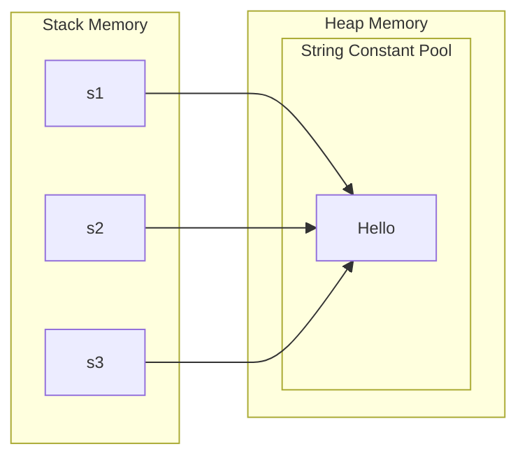
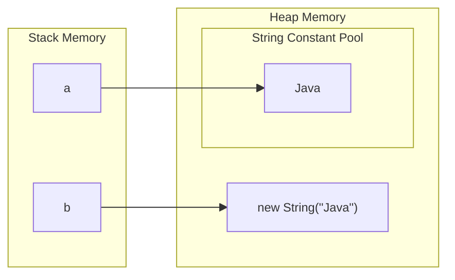
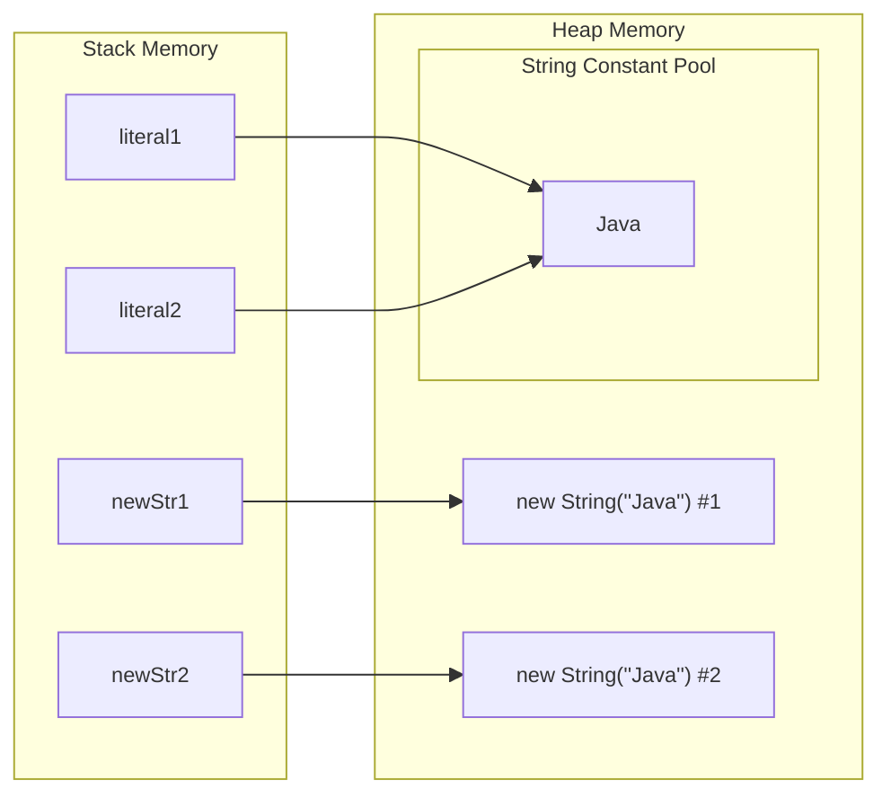
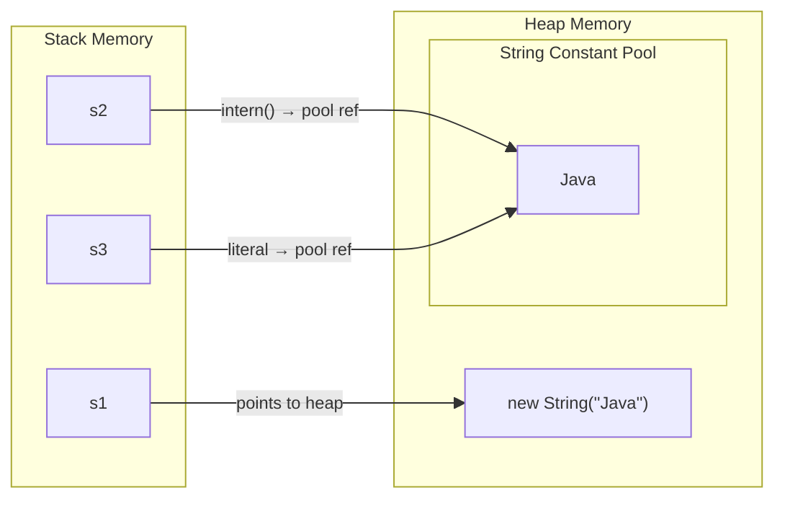

# Strings in Java

## Introduction
In Java, `String` is one of the most fundamental and widely used classes. It represents an **immutable sequence of characters**. Unlike primitive data types, `String` is a **reference type** (class) that provides powerful methods for **text manipulation, comparison, and transformation**.

The `String` class belongs to the `java.lang` package, which is automatically imported into every Java program. Therefore, you do not need to explicitly write: `import java.lang.String;`

Strings are ubiquitous in Java applications — they are **used in user input handling, file I/O operations, network communication, logging, database interactions, and data serialization**.

---


### Key characteristics of the String class
- `String` is a final class, meaning it cannot be subclassed or extended.
- A `String` object internally stores characters as a sequence of Unicode characters (UTF-16 encoded).
- Internally, up to Java 8, `String` stored characters in a `char[]` array. From Java 9 onwards, the JDK introduced Compact Strings, storing characters in a `byte[]` array with an encoding flag to save memory for [Latin-1](https://en.wikipedia.org/wiki/ISO/IEC_8859-1){:target="_blank"} characters.
- `String` implements `Serializable`, `Comparable<String>`, and `CharSequence` interfaces.
- Because String implements `CharSequence`, it can be used wherever a CharSequence is expected (e.g., with `StringBuilder`, regex, etc.).

**String class declaration**
```java
// String class declaration (simplified)
public final class String
    implements java.io.Serializable, Comparable<String>, CharSequence {

    // Java 9+: byte array for compact storage
    private final byte[] value;

    // Java 8 and below: char array
    // private final char value[];
}
```

>`String`** is a reference type, but behaves like a value type** because of immutability and the String Pool. This makes it unique compared to other Java objects.


---


### Immutability of Strings
**Immutability** means that once a `String` object is created, its content **cannot be changed**. Any operation that appears to modify a string actually creates and returns a **new String object**.

```java
String s = "Hello";
s.concat(" World"); // This creates a NEW String but doesn't change s
System.out.println(s); // Output: Hello (original unchanged)

s = s.concat(" World"); // Now s points to the NEW String object
System.out.println(s); // Output: Hello World
```


#### Why is String immutable?
1. **Security:** Strings are widely used as parameters for network connections, file I/O, database connections, class loading, etc. If strings were mutable, a malicious program could change the value after validation — immutability prevents this.
2. **Thread Safety:** Immutable objects are inherently thread-safe. Multiple threads can share the same String object without synchronization because no thread can alter it.
3. **String Pool Efficiency:** Immutability enables the JVM to maintain a pool of string literals. If strings could be changed, one object's modification would corrupt all variables referencing the same pooled string.
4. **Hashcode Caching:** The hashCode() of a String is computed once and cached. This makes String an efficient key for HashMap, HashSet, etc. If strings were mutable, the cached hash would become stale.


#### Internal immutability mechanism
Internally, a `String` is backed by a byte (or character) array. Here's a simplified view of the `String` class:

```java
public final class String {
    private final char[] value;  // Java 8 and earlier
    // Or: private final byte[] value; // Java 9+ (compact strings)
    
    private final int hash;  // Cached hashcode
    
    // No setter methods!
    // All methods that "modify" return new String objects
}
```

**Key points:**

- The internal `byte[]` (or `char[]`) field is `private` and `final`.
- No setter methods are provided.
- The class itself is `final`, preventing subclasses from breaking immutability.


---


### String Constant Pool
The **String Constant Pool** (also called the **String Pool** or **Intern Pool**) is a special memory region inside the **Java Heap** (moved from PermGen to the main Heap in Java 7) where the JVM stores unique string literals.

#### How it works
When you write a string literal in code, the JVM checks the pool first:

- If the same string value already exists in the pool → the existing object is reused.
- If it does not exist → a new `String` object is created in the pool.


```java
String s1 = "Hello"; // "Hello" is created in the String Pool
String s2 = "Hello"; // "Hello" already exists in pool → s2 points to same object
String s3 = "Hello"; // Same — points to same pooled object

System.out.println(s1 == s2); // true  (same reference)
System.out.println(s2 == s3); // true  (same reference)
System.out.println(s1.equals(s2)); // true (same value)
```

**Memory Layout Visualization:**



#### Why the String Pool exists:
- Strings are created very frequently in Java applications.
- Many strings share the same value (e.g., `"true"`, `"false"`, `"null"`, `"GET"`, `"POST"`, etc.).
- Reusing pooled strings saves memory and speeds up equality comparisons (reference check is faster than character-by-character comparison).


#### String Pool in different Java versions
| Java Version | String Pool Location |
|---|---|
| Java 6 and earlier | PermGen (permanent generation) — fixed size, prone to `OutOfMemoryError` |
| Java 7 and later | Main Heap — can grow dynamically, garbage collected |

#### Key distinction
```java
String a = "Java";        // from pool
String b = new String("Java"); // new object in heap (NOT in pool)

System.out.println(a == b);       // false (different references)
System.out.println(a.equals(b));  // true  (same value)
```




>**Rule of thumb:** Always use `.equals()` to compare string content. Use `==` only when you intentionally want to compare object references.


---


### String Literal vs `new String()`

There are two primary ways to create strings in Java, and they behave very differently in memory.

#### String Literal

```java
String s = "Hello";
```

- The JVM looks for `"Hello"` in the **String Pool**.
- If found, `s` points to the existing pooled object.
- If not found, a new `String` object is created **in the pool**, and `s` points to it.
- **Memory efficient** — no duplicate objects for the same value.

#### `new String()`

```java
String s = new String("Hello");
```

- **Always creates a new `String` object** in the regular heap (outside the pool), regardless of whether `"Hello"` already exists in the pool.
- The literal `"Hello"` itself may still be placed in the pool (the argument), but `s` points to the **heap copy**.
- **Less memory efficient** — creates unnecessary duplicate objects.

#### Side-by-side comparison
```java
String literal1 = "Java";
String literal2 = "Java";
String newStr1  = new String("Java");
String newStr2  = new String("Java");

// Reference comparisons
System.out.println(literal1 == literal2); // true  (both point to pool)
System.out.println(literal1 == newStr1);  // false (pool vs heap)
System.out.println(newStr1  == newStr2);  // false (two different heap objects)

// Value comparisons
System.out.println(literal1.equals(newStr1)); // true
System.out.println(newStr1.equals(newStr2));  // true
```



#### When to use `new String()`

Using `new String()` is almost never recommended in production code. A rare valid use case is when you want to ensure a **separate object** (e.g., for use as a unique lock/monitor in synchronization, or to avoid holding a reference to a large pooled string when you only need a small substring).


---


### String Interning

**Interning** is the process of explicitly adding a string to the **String Pool** and retrieving the pooled reference. This is done using the `intern()` method.

```java
public native String intern();
```

#### How `intern()` works  

- If the string's value is already in the pool → returns a reference to that pooled object.
- If the string's value is NOT in the pool → adds a copy to the pool and returns a reference to it.

```java
String s1 = new String("Java"); // heap object, NOT in pool
String s2 = s1.intern();        // adds "Java" to pool (if absent), returns pool reference
String s3 = "Java";             // pool reference

System.out.println(s1 == s2); // false (s1 is heap, s2 is pool)
System.out.println(s2 == s3); // true  (both are pool references)
System.out.println(s1.equals(s3)); // true (same value)
```

**Step-by-step illustration:**




#### Performance benefits of interning

1. **Memory savings:** Thousands of duplicate strings collapse into one pooled instance.
2. **Faster equality checks:** `==` (reference comparison) is O(1) vs `.equals()` which is O(n) for long strings.

#### When to use `intern()`

Interning is beneficial when:

- You have a **large number of duplicate strings** (e.g., parsing CSV files, reading repeated keys from databases).
- You need **fast equality checks** as a performance optimization.


#### Caution with `intern()`
- Overuse can cause the **String Pool to grow very large**, increasing GC pressure.
- In Java 7+, the pool is in the main heap and is garbage collected, but aggressive interning can still hurt performance.
- Generally avoid interning unless profiling shows it's a real bottleneck.


