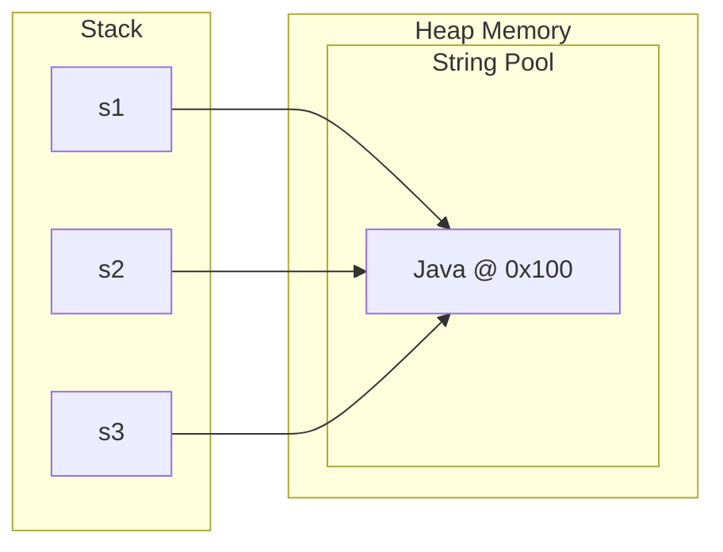
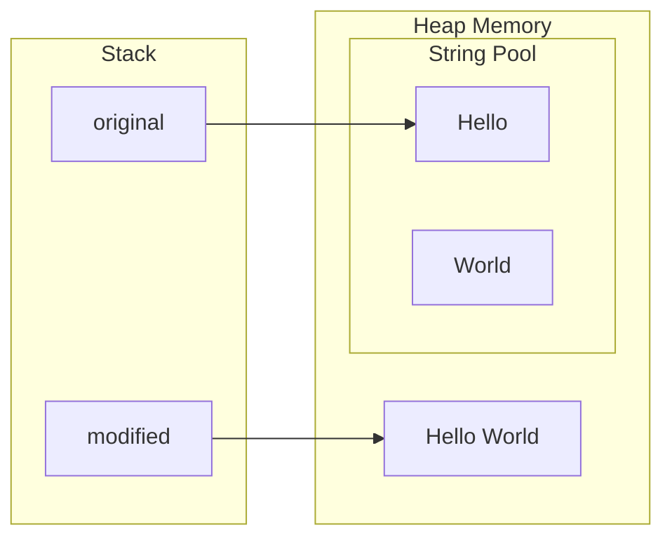

# Strings Immutability

## What is Immutability?
**Immutability** means that once a `String` object is created, its internal state (the character sequence it holds) **cannot be changed**. Any operation that appears to modify a string actually creates a **new String object** with the modified content, leaving the original untouched.

```java 
String str = "Hello";
str.concat(" World");  // Creates new String, but str still points to "Hello"
System.out.println(str);  // Output: "Hello" (unchanged!)

String newStr = str.concat(" World");  // Must capture the new object
System.out.println(newStr);  // Output: "Hello World"
```

### Internal Implementation
Internally, a `String` is backed by a character array. Here's a simplified view of the `String` class:

```java
public final class String {
    private final char[] value;  // Java 8 and earlier
    // Or: private final byte[] value; // Java 9+ (compact strings)
    
    private final int hash;  // Cached hashcode
    
    // No setter methods!
    // All methods that "modify" return new String objects
}
```

**Key points:**

- The `value` array is `private final` - it can't be reassigned after initialization
- The `String` class is `final` - can't be subclassed to add mutable behavior
- No public methods exist to modify the internal character array

### Why Are Strings Immutable?
#### **1. String Pool (Memory Optimization)**

The JVM maintains a **String Pool** where identical string literals are reused:

```java
String s1 = "Java";
String s2 = "Java";
String s3 = "Java";

// All three variables point to THE SAME object in memory
System.out.println(s1 == s2);  // true
System.out.println(s2 == s3);  // true
```

**Memory layout:**


If strings were mutable, changing `s1` would affect `s2` and `s3` - a nightmare! Immutability makes this safe sharing possible, **saving memory**.

#### **2. Security**

Strings are used for sensitive data like:

- File paths
- Network connections
- Database queries
- User credentials

**Security scenario:**
```java
String password = "secret123";

if (authenticate(password)) {
    // Without immutability, password could be changed here
    // by reference manipulation from malicious code
    grantAccess();  // We know password hasn't changed
}
```

####  **3. Thread Safety**

Immutable objects are **inherently thread-safe** - no synchronization needed!
```java
public class ThreadSafeExample {
    private String sharedString = "Shared Data";
    
    // Multiple threads can read this safely without locks
    public String getData() {
        return sharedString;  // No synchronization needed!
    }
}
```

Compare with mutable alternative:
```java
public class NotThreadSafe {
    private StringBuilder mutableString = new StringBuilder("Data");
    
    // REQUIRES synchronization to be safe
    public synchronized String getData() {
        return mutableString.toString();
    }
    
    public synchronized void setData(String data) {
        mutableString.setLength(0);
        mutableString.append(data);
    }
}
```

####  **4. Hashcode Caching**

Since strings can't change, their hashcode can be **computed once and cached**:
```java
public final class String {
    private int hash;  // Default to 0
    
    public int hashCode() {
        int h = hash;
        if (h == 0 && value.length > 0) {
            // Compute only once
            h = calculateHash();
            hash = h;
        }
        return h;
    }
}
```

This makes strings **extremely efficient as HashMap/HashSet keys**:
```java
Map<String, User> userCache = new HashMap<>();
userCache.put("john@email.com", johnUser);  // hashCode computed once

// Later lookups are very fast - no hash recomputation
User john = userCache.get("john@email.com");
```

####  **5. Class Loading**

Class and method names are strings. Immutability prevents security issues:
```java
String className = "com.example.TrustedClass";
Class<?> cla = Class.forName(className);
// If String were mutable, className could be changed to load malicious code!
```


---

### Demonstrating Immutability
**Example 1: Concatenation Creates New Objects**
```java
String original = "Hello";
String modified = original + " World";

System.out.println(original);   // "Hello" (unchanged)
System.out.println(modified);   // "Hello World" (new object)
System.out.println(original == modified);  // false (different objects)
```

**Memory layout:**



**Example 2: String Methods Return New Strings**
```java
String s = "  Java Programming  ";

String trimmed = s.trim();
String upper = s.toUpperCase();
String replaced = s.replace("Java", "Python");

System.out.println(s);         // "  Java Programming  " (UNCHANGED)
System.out.println(trimmed);   // "Java Programming"
System.out.println(upper);     // "  JAVA PROGRAMMING  "
System.out.println(replaced);  // "  Python Programming  "
```


**Example 3: Even Array Manipulation Doesn't Change Original**
```java
String str = "Hello";
char[] chars = str.toCharArray();  // Creates a COPY

chars[0] = 'J';  // Modify the array

System.out.println(str);           // "Hello" (unchanged!)
System.out.println(new String(chars));  // "Jello"
```

**Example 4: Reflection Can't Mutate (Well, Almost...)**  
**Warning:** This is a demonstration of Java internals - NEVER do this in production!

```java
String s = "Hello";

// Using reflection to access private fields (VERY BAD PRACTICE)
Field valueField = String.class.getDeclaredField("value");
valueField.setAccessible(true);
char[] value = (char[]) valueField.get(s);
value[0] = 'J';

System.out.println(s);  // "Jello" (CORRUPTED!)

// This breaks the String pool:
String s2 = "Hello";
System.out.println(s2);  // "Jello" (WRONG! Pool is corrupted)
```

This demonstrates why the `value` field is private and why you should never use reflection to modify strings!


---

### Performance Implications

The Cost of Immutability  
**Problem**: String concatenation in loops
```java
// ❌ VERY INEFFICIENT: O(n²) complexity
String result = "";
for (int i = 0; i < 10000; i++) {
    result += i + ",";  // Creates 10,000 intermediate String objects!
}
```

**What happens:**

1. Iteration 1: `"" + "0,"` → new String `"0,"`
2. Iteration 2: `"0," + "1,"` → new String `"0,1,"` (copies "0,")
3. Iteration 3: `"0,1," + "2,"` → new String `"0,1,2,"` (copies "0,1,")
4. And so on...

**Memory created:**
```
""
"0,"
"0,1,"
"0,1,2,"
"0,1,2,3,"
...
```
Total characters copied: `0 + 2 + 4 + 6 + ... ≈ n²/2`

**The Solution:** `StringBuilder`
```java
// ✅ EFFICIENT: O(n) complexity
StringBuilder sb = new StringBuilder();
for (int i = 0; i < 10000; i++) {
    sb.append(i).append(",");
}
String result = sb.toString();  // Only ONE String object created at the end
```

**How StringBuilder works:**

- Maintains a **mutable** character array
- When capacity is exceeded, creates a larger array and copies
- Only creates a String when you call toString()


---

### Compiler Optimizations
**Compile-Time Concatenation**  
The compiler is smart about string literals
```java
// This code:
String s = "Hello" + " " + "World";

// Is compiled to:
String s = "Hello World";  // Single literal, no concatenation!
```

**Runtime Concatenation (Java 9+)**  
For runtime concatenation, modern Java uses `invokedynamic`:
```java
String name = "Alice";
String greeting = "Hello, " + name + "!";

// Pre-Java 9: Compiled to StringBuilder
StringBuilder temp = new StringBuilder();
temp.append("Hello, ").append(name).append("!");
String greeting = temp.toString();

// Java 9+: Uses invokedynamic with StringConcatFactory
// More efficient, JVM can optimize further
```

---

### Best Practices
**1. Embrace Immutability for Single Operations**
```java
// ✅ Fine for single operations
String result = str.toUpperCase().trim().replace(" ", "_");
```

**2. Use StringBuilder for Multiple Modifications**
```java
// ✅ When building strings in loops
StringBuilder builder = new StringBuilder();
for (Item item : items) {
    builder.append(item.getName()).append(", ");
}
```

**3. Leverage the String Pool**
```java
// ✅ Use literals
String s1 = "constant";

// ❌ Avoid unnecessary object creation
String s2 = new String("constant");  // Creates extra object!
```

**4. Don't Fear Immutability**
```java
// This is FINE - Java optimizes it
String fileName = basePath + "/" + folder + "/" + file;

// This is the PROBLEM - loop concatenation
String csv = "";
for (int i = 0; i < 10000; i++) {
    csv += i + ",";  // ❌
}
```