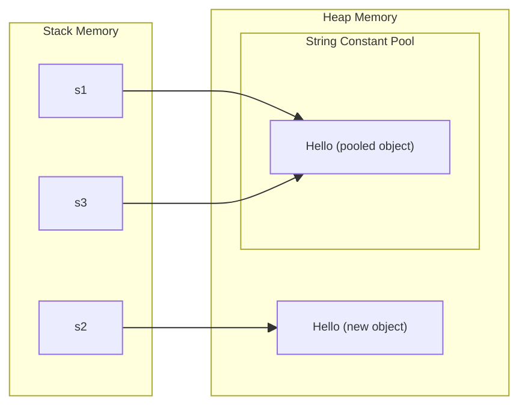

### Creating Strings
There are multiple ways to create `String` objects in Java:

1. **String Literals**
```java
String s1 = "Hello";
String s2 = "Hello";
// s1 == s2 is true (same reference in string pool)
```

2. **Using `new` Keyword**
```java
String s3 = new String("Hello");
String s4 = new String("Hello");
// s3 == s4 is false (different objects)
// s3.equals(s4) is true (same content) 
```

3. **Using `String.valueOf()`**
```java
int num = 123;
String s5 = String.valueOf(num);  // "123"
String s6 = String.valueOf(true); // "true"
String s7 = String.valueOf(3.14); // "3.14"
```

4. **Using `String.format()`**
```java
String s8 = String.format("Name: %s, Age: %d", "Alice", 25);
// "Name: Alice, Age: 25"
```

5. **Text Blocks (Java 15+)**
```java
String json = """
    {
        "name": "Alice",
        "age": 25
    }
    """;
```

--- 

### String Pool & `intern()`

The `String Pool` (or String Intern Pool) is a special memory region in the Java heap where string literals are stored. When you create a string literal, the JVM checks if an identical string already exists in the pool. If it does, the JVM returns a reference to the existing string instead of creating a new object.

**Example with `intern()`:**
```java
String s1 = "Hello";           // In string pool
String s2 = new String("Hello"); // In heap (not pool)
String s3 = s2.intern();       // Returns reference from pool

System.out.println(s1 == s2);  // false (different objects)
System.out.println(s1 == s3);  // true (same pool reference)
System.out.println(s1.equals(s2)); // true (same content)
```

**Memory Layout Visualization:**


**Key Points:**

- String literals are automatically interned
- `new String()` creates a new object on the heap
- `intern()` returns the canonical representation from the pool
- Use literals when possible to leverage the pool
